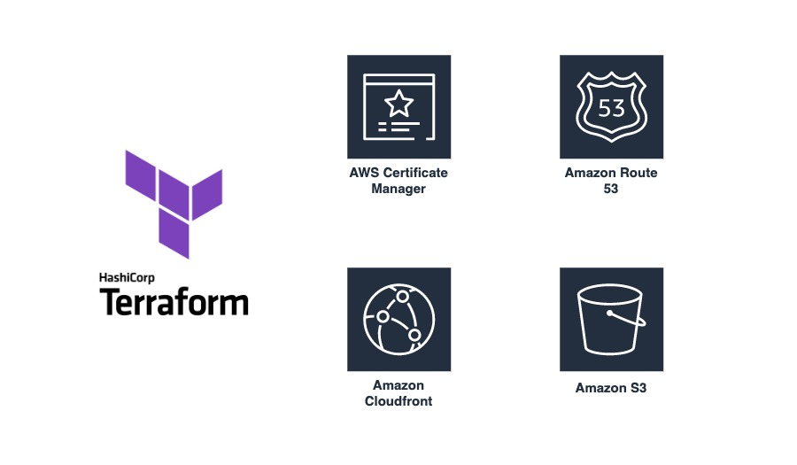

<p align="center">
    
  
<p align="center">
  
</p>

  <p align="center">
    Host your static website on AWS under a minute.
    <br />
  </p>
</p>


<!-- TABLE OF CONTENTS -->
<details open="open">
  <summary>Table of Contents</summary>
  <ol>
    <li>
      <a href="#information">Information</a>
    </li>
    <li>
      <a href="#getting-started">Getting Started</a>
      <ul>
        <li><a href="#prerequisites">Prerequisites</a></li>
        <li><a href="#installation">Installation</a></li>
      </ul>
    </li>
  </ol>
</details>


## Information


This terraform module will create a private S3 bucket, CloudFront distribution with HTTPS endpoint and also origin access identity on our S3 bucket, SSL certificate with certificate manager, and finally it will create a record and it will point to our CloudFront distribution.


### Prerequisites

Before the deployment of this terraform module, make sure your hosted zone exists in Route 53 and move your domain to Route53 by changing NS records on your DNS provider.


### Installation

Change these two variables in the **terraform.tfvars** file.

```

SiteTags = "Example" (Tag value of the resources.)

domainName = "example.com" (This domain name should exists in the Route53. This module point this domain to CloudFront distribution and it will create SSL certificate for this domain name.)

```

You can now run this module when you change the variables.

```
terraform init
terraform plan
terrafom apply --auto-approve

```
